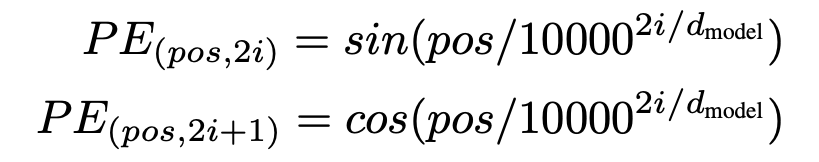
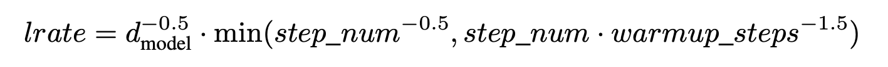
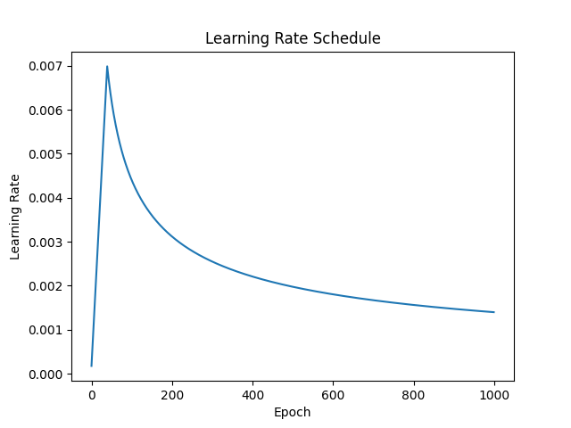
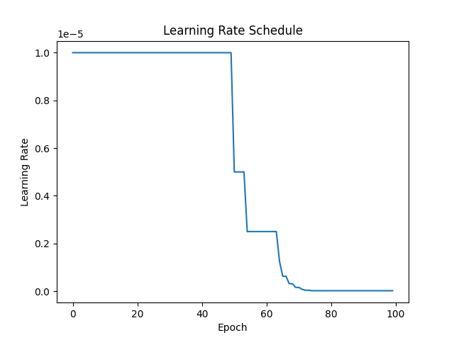
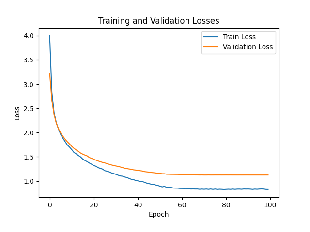
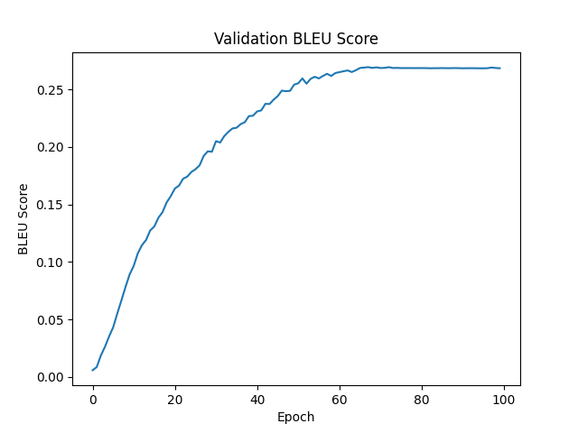

<h1 align="center">Attention Is All You Need</h1>
PyTorch implementation of the transformer architecture presented in "Attention Is All You Need" 
by Ashish Vaswani, Noam Shazeer, Niki Parmar, Jakob Uszkoreit, Llion Jones, Aidan N. Gomez, 
Lukasz Kaiser, Illia Polosukhin


## Architecture
<div align="center">
  
</div>


### Positional Encoding
The position of each token in a sequence is encoded using the following formula and then
added on top of the token's embedding vector.

<div align="center">
  
</div>

<div align="center">
  
</div>


### Multi-head Attention
In a multi-head attention sublayer, the input queries, keys, and values are each projected into 
`num_heads` vectors of size `d_model / num_heads`. Then, `num_heads` scaled dot-product
attention operations are performed in parallel, and their outputs are concatenated and projected back into 
size `d_model`.


## Methods
Overall, this implementation almost exactly follows the architecture and parameters described in [1]. 
However, due to limited resources, I instead trained using the smaller `Multi30k` machine translation dataset.


### Learning Rate Schedule
The learning rate schedule used in [1] is shown below:

<div align="center">
  
</div>

<div align="center">
  
</div>

However, during my experiments, models trained using this schedule failed to achieve BLEU scores above `0.01`.
Instead, I used PyTorch's `ReduceLROnPlateau` scheduler, which decreases the learning rate by `factor=0.5` every
time the validation loss plateaus:

<div align="center">
  
</div>


## Results



For English-to-German translation (EN-DE), my implementation achieved a maximum BLEU score of `27.0` on the test set, 
which is comparable to the `27.3` found in [1].

## Notes
Transformers are trained using a technique called "teacher forcing", which is also used to train recurrent neural networks.
During training, the model is actually given the ground truth `tokens[:n]` as input and asked to predict the `n`th token.

## Setup Instructions
1. Install requirements 
```
python -m pip install -r requirements.txt
```

2. Download spacy language pipelines
```
python -m spacy download en_core_web_sm
python -m spacy download de_core_news_sm
```

## References

[[1](https://arxiv.org/abs/1706.03762)] 
Ashish Vaswani, Noam Shazeer, Niki Parmar, Jakob Uszkoreit, Llion Jones, Aidan N. Gomez, Lukasz Kaiser, Illia Polosukhin.
Attention Is All You Need. 
_arXiv:1706.03762 [cs.CL]_
