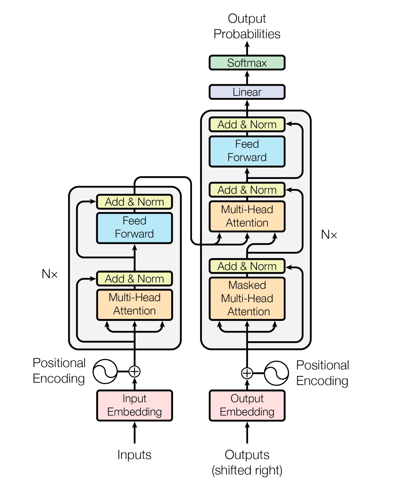
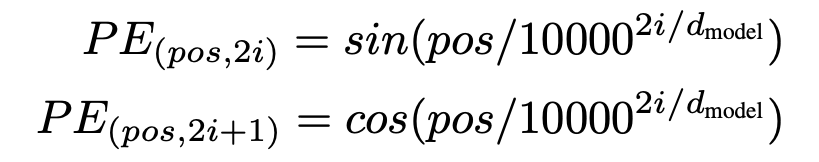
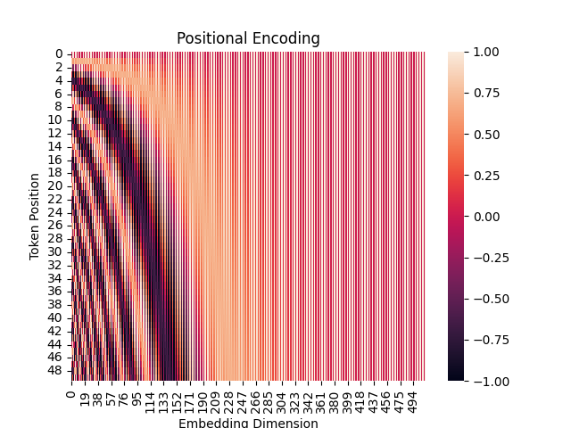

<h1 align="center">Attention Is All You Need</h1>
PyTorch implementation of the transformer architecture presented in "Attention Is All You Need" 
by Ashish Vaswani, Noam Shazeer, Niki Parmar, Jakob Uszkoreit, Llion Jones, Aidan N. Gomez, 
Lukasz Kaiser, Illia Polosukhin


## Methods
This is the transformer architecture as described in [1]:
<div align="center">
  
</div>


### Positional Encoding
The position of each token in a sequence is encoded using the following formula:

<div align="center">
  
</div>

Here is a visualization of the positional encoding:

<div align="center">
  
</div>


### Multi-head Attention


## Results


## Notes
- Input of size `batch_size * sequence_length * embedding_size`
- length of sequence can vary: `W_Q, W_K, W_V` are all of shape `d_model * d_v` which does not depend on sequence length
- output of the topmost encoder layer is fed in as the `key` and `value` into each layer in the decoder
- "Teacher forcing"
  - during training, the transformer has access to the ground truth words before the current position
  - It then generates a prediction using those words at the current position
  - But what about the first word? How does transformer predict first word without previous decoder outputs?
    - Special "start of sequence" symbol `<sos>` is at the start of every sequence, fixes this off-by-one issue
    - On first pass, transformer sees the `source` sequence and `prev=[<sos>]`, so it knows to predict the first word
    - On second pass, transformer now sees `source` and `prev=[<sos>, first_prediction]`


# Setup Instructions
1. Run `python -m pip install -r requirements.txt`
2. Download spacy language pipelines
```
python -m spacy download en_core_web_sm
python -m spacy download de_core_news_sm
```

## References

[[1](https://arxiv.org/abs/1706.03762)] 
Ashish Vaswani, Noam Shazeer, Niki Parmar, Jakob Uszkoreit, Llion Jones, Aidan N. Gomez, Lukasz Kaiser, Illia Polosukhin.
Attention Is All You Need. 
_arXiv:1706.03762 [cs.CL]_
